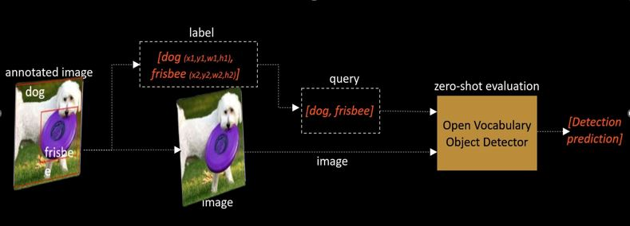

# Open-Vocabulary Object Detectors: Robustness Challenges under Distribution Shifts, ECCV Workshops 2024

This repository contains code for evaluating the robustness of various open-vocabulary object detection models. Specifically, it addresses challenges in robustness when dealing with Out-Of-Distribution (OOD) shifts across different benchmarks, including COCO-O, COCO-C, and COCO-DC.

Visit Project Website - [https://prakashchhipa.github.io/projects/ovod_robustness/]

Arxiv - [https://arxiv.org/pdf/2405.14874]

]

## Dependencies
- Build Grounding DINO from [GroundingDINO](https://github.com/IDEA-Research/GroundingDINO)
- YOLO-WORLD and OWL-ViT - Install via Huggingface package
- Pytorch 2.0 and CUDA 12.x

## OOD Benchmarks

### COCO-C Dataset Preparation
Install image corruptions with:
```bash
pip3 install imagecorruptions
```
Then run the benchmark preparation script:
```bash
python create_coco_c_benchmarks.py
```

### COCO-O Dataset
- Paper: [COCO-O](https://openaccess.thecvf.com/content/ICCV2023/papers/Mao_COCO-O_A_Benchmark_for_Object_Detectors_under_Natural_Distribution_Shifts_ICCV_2023_paper.pdf)
- Dataset: [COCO-O GitHub](https://github.com/alibaba/easyrobust/tree/main/benchmarks/coco_o)

### COCO-DC Dataset
- Paper: [COCO-DC](https://arxiv.org/html/2403.04701v1)
- Dataset: [ObjectCompose GitHub](https://github.com/Muhammad-Huzaifaa/ObjectCompose)

## Zero-Shot Evaluation of Open-Vocabulary Object Detection Models

### Evaluate YOLO-WORLD
```bash
torchrun --nproc_per_node=1 --master_port=<PORT_NO> train_yolo.py --dataset coco --test-only --gpu_id <GPU_ID> --data_path <PATH_OF_COCO_O/COCO_C/COCO_DC> --subset <SUBSET> --corruption <ONLY_FOR_COCO_C> --severity <ONLY_FOR_COCO_C>
```

### Evaluate GroundingDINO
```bash
torchrun --nproc_per_node=1 --master_port=<PORT_NO> train_dino.py --dataset coco --test-only --gpu_id <GPU_ID> --data_path <PATH_OF_COCO_O/COCO_C/COCO_DC> --subset <SUBSET> --corruption <ONLY_FOR_COCO_C> --severity <ONLY_FOR_COCO_C>
```

### Evaluate OWL-ViT
```bash
torchrun --nproc_per_node=1 --master_port=<PORT_NO> train_owlvit.py --dataset coco --test-only --gpu_id <GPU_ID> --data_path <PATH_OF_COCO_O/COCO_C/COCO_DC> --subset <SUBSET> --corruption <ONLY_FOR_COCO_C> --severity <ONLY_FOR_COCO_C>
```
